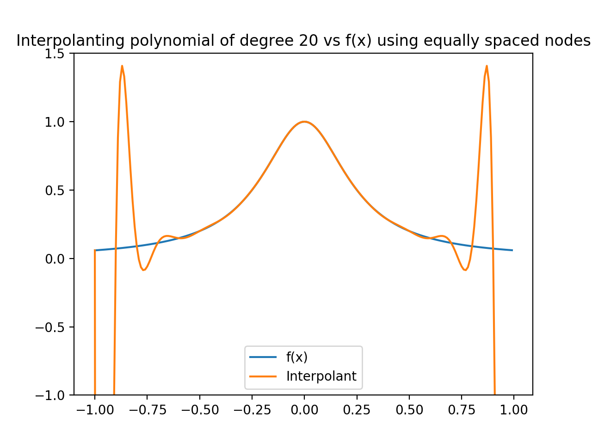

# Numerical-Analysis
Root Finding Methods, Runge-Kutta Method to solve first order ODE's and systems of first order ODE's, Composite Integration and Interpolating polynomial using Newton Divided Differences

#
#### Python packages/library's used: 
- Pandas
- Numpy
- Matplotlib
- Scipy

#
#### Root Finding Methods:

The Root_Finding_Methods.py file implements Newtons Method, the Secant Method and the Bisection Method to approximate the roots of the following function:

Roots are: -5, 10 and -10

#
#### Runge Kutta method to solve a first order ordinary differential equation:

The Classic_Runge_Kutta_FirstOrder_ODE.py file uses the classic RK4 method to find approximations, at equally spaced time points, to the exact solution of the following first order ordinary differential equation:  

#
#### Runge Kutta method to solve a coupled system of first order ordinary differential equations:

The Classic_Runge_Kutta_SystemODEs.py file uses the classic RK4 method to find approximations, at equally spaced time points, to the exact solution of the following first order system of ordinary differential equations:  

#### Interpolating polynomials:

The interpolating_polynomials.py file used Newtons Divided Differences to create a interpolating polynomial for the function 1/(16(x^2) + 1). The runge phenomenon is explored whereby high order interpolants oscillate significantly at the end of a specified interval when using equally spaced nodes. The problem is then mitigated through the use of chebyshev nodes. 

Images of the interpolants:

